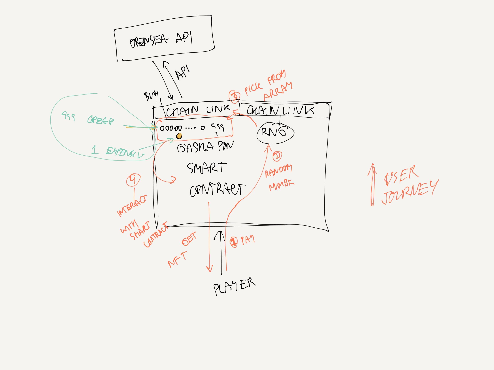

<!-- @format -->

This is a [Next.js](https://nextjs.org/) project bootstrapped with [`create-next-app`](https://github.com/vercel/next.js/tree/canary/packages/create-next-app).

## Getting Started

First, run the development server:

```bash
npm run dev
# or
yarn dev
```

Open [http://localhost:3000](http://localhost:3000) with your browser to see the result.

You can start editing the page by modifying `pages/index.tsx`. The page auto-updates as you edit the file.

[API routes](https://nextjs.org/docs/api-routes/introduction) can be accessed on [http://localhost:3000/api/hello](http://localhost:3000/api/hello). This endpoint can be edited in `pages/api/hello.ts`.

The `pages/api` directory is mapped to `/api/*`. Files in this directory are treated as [API routes](https://nextjs.org/docs/api-routes/introduction) instead of React pages.

## Learn More

To learn more about Next.js, take a look at the following resources:

- [Next.js Documentation](https://nextjs.org/docs) - learn about Next.js features and API.
- [Learn Next.js](https://nextjs.org/learn) - an interactive Next.js tutorial.

You can check out [the Next.js GitHub repository](https://github.com/vercel/next.js/) - your feedback and contributions are welcome!

## Deploy on Vercel

The easiest way to deploy your Next.js app is to use the [Vercel Platform](https://vercel.com/new?utm_medium=default-template&filter=next.js&utm_source=create-next-app&utm_campaign=create-next-app-readme) from the creators of Next.js.

Check out our [Next.js deployment documentation](https://nextjs.org/docs/deployment) for more details.

## For Tokyo web3 Hackathon

今回時間内に全ての工程を終わらせることができなかったので、ホワイトペーパー(最終的な仕様)を以下に英語で述べております。

現状での操作は、　
・ガシャポンに画像をアップロードし、NFT としてプールに入れる。(opensea の API を用いた NFT の引き入れが困難)
・Play Gashapon ボタンをクリックし、自分以外の NFT がランダムで購入可能。(最終的には、このランダムを Chainlink を用いて実装予定です)
・自分の所有している NFT を profile にて閲覧可能。

## Whitepaper

# What is Gashapon?

- A pool of 999 cheap NFT + 1 Rare NFT. Player comes and pay an affordable fix fee and they have a chance to win some NFT and a rare one
- The basic idea that it’s like lootboxes where you can get packs of NFTs

# The problem that we are solving

- For player, I want to discover a new NFT projects
- For player, I cannot afford 50ETH bored ape
- For unpopular creator/project, there’s more chance that it gets exposure

# Mechanics

- We randomly take 999 NFTs from opensea from the Cheap price range and then randomly get 1 NFT from the expensive price range. When user comes and play, and let say, they got the cheap price range, then we will have 998 + 1. Then we top up the cheap one so it becomes 999 + 1 again

# Technical

- The contract should be able to **randomly** get 999 cheap NFT from openseas when first deployed
- The contract should be able to **randomly** get 1 rare NFT from opeanseas when first deployed
- When player pay the fee and they get the cheap one, the contract also should excecute that it buys the cheap NFT, to top up the pool so that it’s 999+1 again (same goes with the case when player wins the expensive one, the contract should have enough money to buy the expensive one)

# Gashapon architect stack


